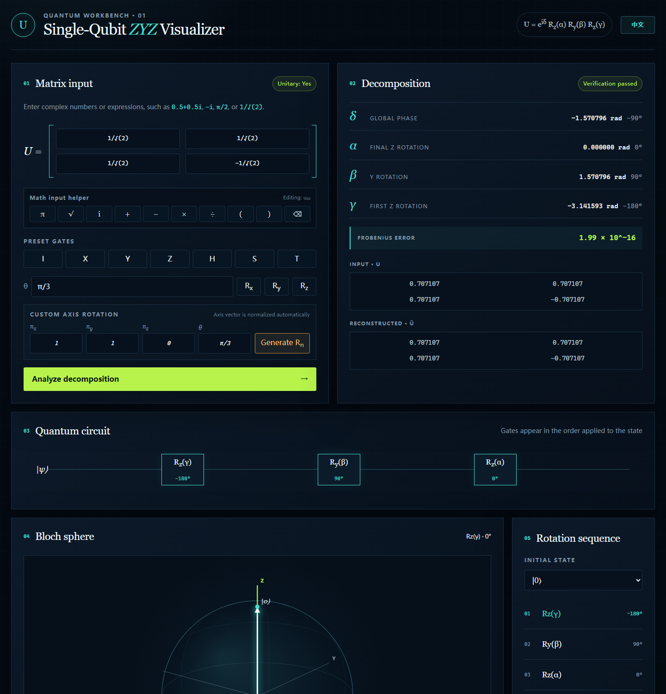

# Single-Qubit ZYZ Decomposition Visualizer

一个无需后端、无需构建步骤的单量子比特 ZYZ 分解教学与验证工具。输入任意 2×2 复矩阵后，页面会验证其酉性，提取全局相位，计算 ZYZ 欧拉角，通过重构误差验证结果，并以量子线路和交互式 Bloch 球展示门的实际作用顺序。



## 功能

- 支持 `a`、`a+bi`、`a-bi`、`bi`、`pi`/`π`、`sqrt(...)`/`√(...)`、括号和四则运算
- 数学输入助手可一键插入 `π`、`√`、`i`、`×`、`÷` 等符号
- 界面默认英文，可在右上角切换中文；选择会保存在当前浏览器
- 使用 Frobenius 范数验证 `U†U ≈ I`
- 计算 `δ`、`α`、`β`、`γ`，同时显示弧度和角度
- 单独处理 `β ≈ 0` 与 `β ≈ π` 的欧拉角奇异点
- 重构原矩阵并显示数值误差与验证状态
- 内置 I、X、Y、Z、H、S、T 和 Rx/Ry/Rz 旋转门
- 支持输入任意轴向量 `(nₓ,nᵧ,n_z)` 和角度 θ，生成并直接播放任意轴旋转
- 生成按 `Rz(γ) → Ry(β) → Rz(α)` 排列的量子线路
- 交互式 Bloch 球：拖动视角、滚轮缩放、旋转轨迹和旋转轴高亮
- 支持 `|0⟩`、`|1⟩`、`|+⟩`、`|−⟩`、`|+i⟩`、`|−i⟩` 及自定义纯态
- 支持播放、暂停、重置、上一步和下一步
- 桌面端和移动端自适应

## 数学原理

采用标准量子计算约定：

```text
Rz(θ) = exp(-iθZ/2)
Ry(θ) = exp(-iθY/2)
U = exp(iδ) Rz(α) Ry(β) Rz(γ)
```

对于 `U ∈ U(2)`：

1. 由 `det(U) = exp(i2δ)` 取 `δ = arg(det(U))/2`。
2. 构造 `V = exp(-iδ)U`，使 `V ∈ SU(2)`。
3. 对 `V` 做 ZYZ 欧拉角分解。
4. 重构 `Ũ = exp(iδ)Rz(α)Ry(β)Rz(γ)`。
5. 计算 `||U - Ũ||F` 并验证结果。

一般情形下，若 `p = arg(V00)`、`q = arg(V10)`，则可取：

```text
β = 2 atan2(|V10|, |V00|)
α = q - p
γ = -p - q
```

当 `β ≈ 0` 时只有 `α + γ` 能被确定，工具固定 `α = 0`；当 `β ≈ π` 时只有 `α - γ` 能被确定，工具固定 `γ = 0`。全局相位和欧拉角都存在等价分支，因此程序以最终矩阵重构为准，而不假设角度表示唯一。

矩阵从右向左作用，所以量子态经历的门序列是：

```text
Rz(γ) → Ry(β) → Rz(α)
```

全局相位 `exp(iδ)` 不改变测量概率，也不改变 Bloch 向量，因此不会被画成空间旋转。

对于自定义轴，工具先将非零轴向量归一化为 `n=(nₓ,nᵧ,n_z)`，再构造：

```text
Rn(θ) = exp[-i θ (nₓX + nᵧY + n_zZ) / 2]
```

这个矩阵仍会接受完整的 ZYZ 分解。Bloch 球的动画路径可以在“ZYZ 分解路径”和“直接绕自定义轴”之间切换；两条路径的最终量子变换相同。

## 项目结构

```text
.
├── index.html
├── css/
│   └── style.css
├── js/
│   ├── complex.js      # 复数与安全表达式解析
│   ├── matrix.js       # 2×2 复矩阵运算
│   ├── quantum.js      # 量子门与 Bloch 向量旋转
│   ├── zyz.js          # ZYZ 分解和重构验证
│   ├── bloch.js        # Bloch 球绘制与动画控制
│   ├── ui.js           # 页面交互和结果展示
│   └── main.js         # 应用入口
├── scripts/
│   └── serve.js        # 零依赖本地静态服务器
├── tests/
│   └── zyz.test.js
└── package.json
```

## 本地运行

项目没有第三方运行时依赖，也没有构建步骤。安装 Node.js 后运行：

```bash
npm start
```

浏览器打开 `http://127.0.0.1:4173`。也可以使用任意静态文件服务器，例如 VS Code Live Server。

> 由于项目使用 ES modules，请通过本地 HTTP 服务器访问，不建议直接双击 `index.html`。

## 测试

```bash
npm test
```

测试覆盖：

- I、X、Y、Z、H、S、T
- Rx(π/3)、Ry(π/4)、Rz(π/5)
- 任意轴旋转、轴向量自动归一化及 Bloch 向量长度保持
- `π`、`√`、`×`、`÷` 等数学符号解析
- `β = 0`、`β ≈ 0`、`β = π`、`β ≈ π`
- 100 个固定随机种子生成的合法 U(2) 矩阵
- 非酉矩阵拒绝路径

每个合法样本同时验证酉性和 `||U - Ũ||F < 10⁻⁸`。

## 部署到 GitHub Pages

1. 将仓库推送到 GitHub，确保 `index.html` 位于仓库根目录。
2. 打开仓库的 **Settings → Pages**。
3. 在 **Build and deployment** 中选择 **Deploy from a branch**。
4. 选择 `main` 分支和 `/(root)` 目录，然后保存。
5. 等待 GitHub Pages 发布完成；站点不需要环境变量、服务器或构建命令。

所有链接均为相对路径，项目部署在 `https://用户名.github.io/仓库名/` 这样的子路径时也可正常工作。

## 技术栈

- 语义化 HTML5
- 原生 CSS（响应式布局）
- 原生 JavaScript ES modules
- Canvas 2D 自研三维投影与交互
- Node.js 内置测试工具和本地静态服务器，仅用于开发

页面本身不依赖 Node.js、Python、数据库、服务端 API 或第三方 CDN。

## 未来计划

- 在 Bloch 球上叠加多个输入态对比
- 导出分解结果与线路图
- 增加数值容差设置和更完整的表达式函数
- 增加 QASM / 常见量子 SDK 代码导出
- 加入更多分解方式（ZXZ、XYX 等）

## 浏览器支持

建议使用近期版本的 Chrome、Edge、Firefox 或 Safari。页面使用 Canvas、ES modules、ResizeObserver 和 Pointer Events。

